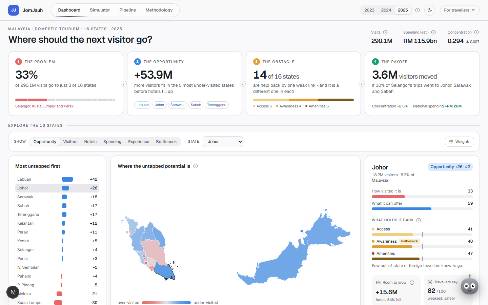

<div align="center">

# JomJauh + JomRasa



[Live dashboard](https://jomjauh.vercel.app) · [Trip planner](https://jomjauh.vercel.app/trip) · [Pipeline page](https://jomjauh.vercel.app/pipeline) · [How to run](docs/RUNNING.md)


</div>

Ever planned a Malaysian holiday and ended up in the same three states as everyone else? A third of all domestic trips go to Selangor, Kuala Lumpur and Perak, while other states sit with half-empty hotels and plenty to see. So I built JomJauh, a dashboard that shows planners which states are untapped and why, and JomRasa, a trip planner that sends travellers there with a real day-by-day plan. Built for the DOSM Datathon 2026 on official open data, with every cleaning step measured and shown on the site.

## Features

- **Opportunity score**: what a state can offer minus how visited it already is, for all 16 states.
- **Bottleneck Diagnoser**: is the state hard to reach, not well known, or short of places to stay?
- **Room to grow**: how many more visitors the existing hotels can take before they fill up.
- **Simulator**: move visitors from a crowded state to quiet ones and see who gains, who loses, and whether the hotels cope.
- **Traveller voices**: public travel posts in Malay, English and Chinese, read by AI and turned into a score per state, with every quote linked to its source.
- **Trip planner**: a two-day plan from breakfast to supper, a route on the map, a place to sleep, and the best months to go. Real places only.
- **Pipeline page**: every cleaning method, how many items it caught, and why.
- **Jojo**: a guide in the corner that explains whatever you point at, in plain words.

## Technical highlight

Nothing on the site is typed in. The Pipeline page reads counts from an audit that re-runs the cleaning code on the raw files with counters attached, so it always says what really happened: 112 repeated state-years removed, 1,914 duplicate posts dropped, 16 states adding up to DOSM's national total to the decimal. The dashboard recalculates every score live in TypeScript, and a test suite requires those answers to match the Python reference to five decimal places. If any of the 110 tests fail, nothing is published.

## Tech stack

- Python, pandas, pyarrow - pipeline and the reference metrics
- pytest, vitest - data checks and Python vs TypeScript agreement
- Next.js, React, TypeScript, Tailwind CSS - dashboard and trip planner
- motion, d3-geo, Leaflet - animation, the state map, the route map
- Gemini 2.5 Flash Lite via OpenRouter - tagging travel posts and choosing trip stops
- DOSM, data.gov.my, Tourism Malaysia, OpenStreetMap, Wikivoyage, Open-Meteo, Exa, YouTube - data
- Vercel - hosting, deployed on every push to main

## Run it

```bash
uv venv --python 3.12 .venv && uv pip install --python .venv/Scripts/python.exe -r requirements-dev.txt
python -m pipeline.extract && python -m pipeline.transform_structured && python -m pipeline.build_panel
python -m pytest tests -q && python -m pipeline.export_web
cd web && npm install && npm run dev
```

Full steps, including the traveller text and the trip planner data, are in [docs/RUNNING.md](docs/RUNNING.md).

## License

MIT for the code. Data keeps its publishers' licences, listed in [docs/RUNNING.md](docs/RUNNING.md).
